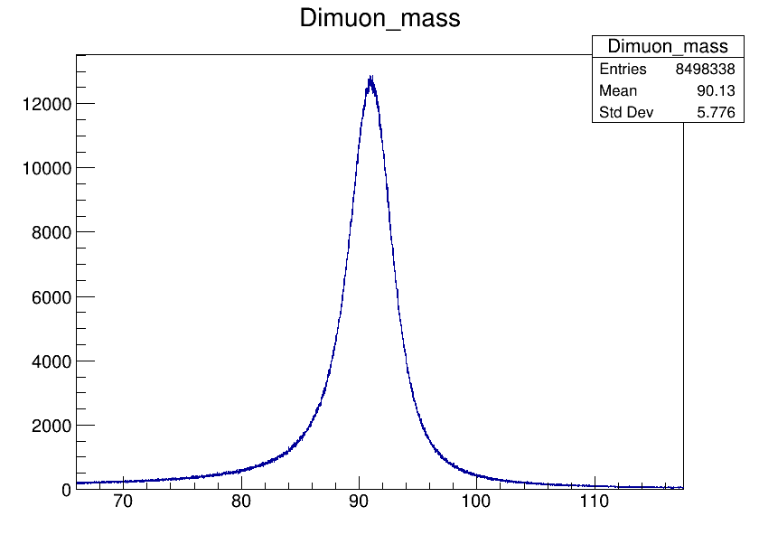

# Notes on ROOT and Analysis workflow
## Accessing CloudVeneto
So, to access CloudVeneto please look at the [dedicated README](https://github.com/pietrobernard/LaCP-Project-2324/tree/main/LCP%20B/final_project/scripts)

## ROOT files
The data analysis usually runs in multiple stages. The first stage will apply cuts and selection rules on the data, in order to select events according to the process we want to investigate. This will produce smaller ROOT files (ideally one ROOT file per process) that can then be converted into pure-python objects to be fed to more advanced analysis tools, machine learning algorithms, etc that will constitute the following stages of the analysis.

### Data Location
All of our data resides on the virtual disk that is mounted at the following path in our server:
```bash
/mnt/TTV
```

### Data Structure
Think of a ROOT file as a computer directory. You can store whatever you like inside of it: datasets, histograms, plots and generic objects (like you do in Python when you save objects to disk so that you can reload them later, the principle is exactly the same). Now, in our case the key entity will be the dataset. ROOT stores data in data structures known as <b>Trees</b>. There can be many ROOT trees in any given file. A tree is made up of several <b>branches</b>. Think of a branch as a feature in the usual machine-learning slang. In our case we have several hundreds of these. Each branch has a name that corresponds to the feature it represents. For instance we'll have a branch named "Electron_pt" that will host the electron's transverse momentum.

Now, an <b>event</b> at index $i$ is defined to be the set of all features indexed by that index.

In other words: if you think about the Tree as a giant table where each branch is a distinct column, then an event is simply the $i$-th row of such table. For instance suppose you have a tree with $3$ branches A, B and C and you have $100$ events (so, $100$ rows), then the third event would be the collection: $(A[3], B[3], C[3])$.

In our case we have that the tree that is hosting our data, for each file, is called "Events". We'll have to use several files but for each file, the structure it's exactly the same, so every file will have its "Events" tree and each "Events" tree will have exactly the same number and name of the branches.

All of our branches are thoroughly described in the CMS AOD file that is [accessible from this link](https://cms-nanoaod-integration.web.cern.ch/autoDoc/NanoAODv9/2018UL/doc_TTToSemiLeptonic_TuneCP5_13TeV-powheg-pythia8_RunIISummer20UL18NanoAODv9-106X_upgrade2018_realistic_v16_L1v1-v1.html).

### Data access - Basic
Now comes the tricky part. The usual workflow when dealing with trees is the following: one just loops through all the events and selects them according to some criteria that is required by the analysis (for instance the electron's transverse momentum to lie within a certain range, etc). These selected events are then collected in smaller ROOT files for further analysis. All of this is usual done in C++ since it's the fastest possible way. But, in recent years, ROOT's developer have put forth a new Python binding, called PyROOT, that allows to do I/O via Python in a very nice way.

Starting off with the easiest approach. The "old way" of reading a ROOT file is shown below. Suppose we want to extract the 'nElectron' branch from the tree 'Events' inside the file 'data.root':
```python
  import ROOT

  # opening the root file
  f = ROOT.TFile.Open("data.root")

  # the Events tree will be accessible as an attribute of the 'f' object, so: f.Events
  # we want to loop through all the events -> f.Events.GetEntries()
  extracted = []
  for event_idx in range(0,f.Events.GetEntries(),1):
      # let's load the 'event_idx' event into memory
      f.Events.GetEntry(event_idx)
      # now, all the various features have been loaded with the appropriate values
      extracted.append(f.Events.nElectron)

  # when you're done, close the file
  f.Close()
```
So, here is how this works:
1. When you open a ROOT file, PyROOT will istantiate a TFile object (f in the script) that will contain as an attribute all the trees in the file. For instance, f.Events will be the "Events" tree, and so forth.
2. An event is loaded by calling the `GetEntry`method upon the tree object, for instance: `f.Events.GetEntry(0)` will load up the event at "row" 0.
3. When the event is loaded, the values corresponding to the various branches at that index (row) are accessible via `f.Events.branch_name`. So for instance, after calling `f.Events.GetEntry(0)`:
   * `f.Events.nElectron`
   * `f.Events.electron_pt`
   * `f.Events.electron_phi`
   are filled with their respective values for the row 0.

This method is very easy and, unfortunately, also very slow. C++ can loop through several millions events in a couple of seconds while Python takes more than 2 minutes. So, we need a better approach.

### Data Access - The efficient way - RDataFrames (RDF)
#### Introduction
Suppose that, as in our case, we have several thousands of root files: with an average of $2$ minutes per file, we would be looking for $\approx 33$ hours just to apply some initial cuts. It's clearly unfeasible, not to mention the enormous memory requirement (the whole lot of files is more than $1500$ GB). Luckily, `RDataFrames` come to the rescue.
A RDataFrame is similar to a hybrid between a Dask DataFrame and a Pandas DataFrame, meaning that its behaviour is sometimes lazy, sometimes immediate. Let's start by saying that when working with RDataFrames, the workflow is like that:
1. <b>Define</b> an RDF, in one line:
   ```python
   df = ROOT.RDataFrame("Events", "filename.root")
   ```
   the nice thing about RDF is that it is possible to chain together multiple files. Suppose that in the folder we're in there are multiple ROOT files, all with the same structure (as in our case). To create a giant dataset with all of them, it is sufficient to write:
   ```python
   df = ROOT.RDataFrame("Events", "*.root")
   ```
   At this point note that `df` is a "view" on the actual dataset, nothing has been loaded into memory (lazy).
2. Apply <b>transformations</b> on the dataset. A transformation can be one of the following:
   1. A <b>filter</b> on the existing features. Multiple filters can be chained together for very complex selection rules.
   2. A <b>definition</b> of a new feature.
3. Get <b>results</b> by applying <b>actions</b>, and display them or save them to disk, producing another ROOT file, or NumPy output.

#### Transformations
Let's look at <b>filters</b> first. A filter in ROOT is pretty much as it was in NumPy or Pandas. The underlying logic is the same: select events according to some rules that we impose on some features. Now, even if we're using ROOT from Python, we're just using an interface. Under the hood everything is C++ and the filters are defined in C++ too. Let's see an example:
<p><b>First example: simple filter implemented direcly</b></p>

```python
  import ROOT
  df = ROOT.RDataFrame("Events", "data.root")
  # we want to select events where the number of Muons is exactly 2
  filter_name = "Number of Muons = 2"
  filter_1 = df.Filter('nMuon == 2', filter_name)
  # filter_1 will contain only the events where nMuon is 2
```
So, the `df.Filter` applies a filter on the RDF. The string `nMuon == 2` is a bit unassuming, but this is actually C++ code! The `filter_name` is the name for the filter and it's just a string. It is very useful to name the filters because in this way when we combine many of them, we can track the individual contribution of each of them to the overall event selection process. Notice how the `nMuon` in the filter is the name of the branch in the ROOT file.

<p><b>Second example: simple filter implemented as C++ function</b></p>

Another way to write this would be by defining a filter as a function explicitly.
```python
  import ROOT

  # let's define a C++ function from inside python
  ROOT.gInterpreter.Declare("""
    // this is C++ code
    bool muonFilter(int nMuon) {
      return (nMuon==2);
    }
  """)

  # and now let's call the C++ function from python
  df = ROOT.RDataFrame("Events", "data.root")
  filter_name = "Number of Muons = 2"
  filter_1 = df.Filter('muonFilter(nMuons)', filter_name)
```

<p><b>Third example: simple filter implemented with Numba decorator</b></p>

A third way to do this, in pure Python, requires to use decorators to compile python functions into C++ code at runtime.
```python
  import ROOT

  @ROOT.Numba.Declare(["int"], "bool")
  def muonFilter(nMuon):
    return (nMuon==2)

  # and as before
  df = ROOT.RDataFrame("Events", "data.root")
  filter_name = "Number of Muons = 2"
  filter_1 = df.Filter('Numba::muonFilter(nMuon)', filter_name)
```

All of these three approaches produce the same results. The last two may appear more complicated but when more complex filtering is desired, they are the only way to do things. We can finally inspect the aftermath of a chain of filters acting on the RDF via the `Report` action:
```python
  repo = df.Report()
  repo.Print()
```
will print something like:
```
  Number of Muons = 2 : pass=145320     all=414392     -- eff=35.07 % cumulative eff=35.07 %
```
informing us on how restrictive the filter was.

#### Definitions of features
It can happen that we'll need to define new features along the way. Think about the invariant mass for instance. Let's consider, as an example, the "DiMuon" invariant mass (i.e. the invariant mass for events that have two muons in their final states). The invariant mass is computed starting from the two muons' transverse momenta, pseudorapidities $\eta$s and radial angles $\phi$s like:

$$
  M = \sqrt{2\cdot p_{T,1}p_{T_2} (\cosh(\eta_1 - \eta_2) - \cos(\phi_1 - \phi_2)) }
$$

The new feature will be <b>added</b> to all the others. Let's define a function in python that computes this and let's decorate it in order to translate it into C++ as we did for the Filters above:
```python
  # notice now that we use RVec<float> since now we have two muons, so we need arrays to store their features' values
  @ROOT.Numba.Declare(["RVec<float>", "RVec<float>", "RVec<float>"], "float")
  def InvariantMass(pt, eta, phi):
    return ROOT.sqrt(2*pt[0]*pt[1]*(ROOT.cosh(eta[0]-eta[1]) - ROOT.cos(phi[0]-phi[1])))

  # defining the RDF
  df = ROOT.RDataFrame("Events", "data.root")

  # applying a filter on the number of muons
  nMuons_df = df.Filter("nMuons == 2", "nMuon filter")

  # defining the invariant mass feature
  # the first argument is the new feature name (i.e. a new branch in the root file)
  # the second argument is the string calling the function we decorated above
  # as before, the arguments to the function must be the branches names exactly as they are written in the ROOT file
  invMass_df = nMuons_df.Define('InvMass', 'Numba::InvariantMass(Muon_pt, Muon_eta, Muon_phi)')
```

#### Remarks
In order to define new features it is not necessary to write C++ code this way. It is actually possible to write these functions in a C++ library and load that library into Python. In this way, the above example would become:
```python
  import ROOT
  # loading the library
  ROOT.gSystem.Load('./LCP_B.so')

  # defining the RDF
  df = ROOT.RDataFrame("Events", "data.root")

  # applying a filter on the number of muons
  nMuons_df = df.Filter("nMuons == 2", "nMuon filter")

  # defining the invariant mass feature
  invMass_df = nMuons_df.Define('InvMass', 'InvariantMass(Muon_pt, Muon_eta, Muon_phi)')
```
where `ÌnvariantMass` is already pre-programmed inside the lib, so no additional work is needed.

#### Results
So, now that we've seen how to transform the data and how to define new features, it would be useful to save or display our data. There are two useful actions for this.
1.  <b>HistoND</b>
    These methods produce ROOT histograms in one or two dimensions. For instance, suppose we want to plot the invariant mass defined above:
    ```python
    invMass_df.Histo1D(("histogram_name","histogram_title",number_of_bins,x_start,x_end), "InvMass")
    ```
    where the last argument is the name of the branch we want to plot.
    
2.  <b>Snapshot</b>
    This method allows to save the dataset to disk. Usually, after the cuts have been imposed the dataset is quite smaller and sometimes one is interested in saving only the binned data (histograms). It works like this:
    ```python
    invMass_df.Snapshot("TreeName", "outputFile.root", ("list","of","features","to","save"))
    ```
    if no list of features is provided, then the entire set is saved.


#### Full example
Let's consider an example where we calculate the invariant mass for the "Dimuon". Note that this example is incomplete because it uses ROOT files from only one folder, so no weighting by luminosity has been applied (when we'll consider events over all the runs, of course we'll have to reweight the events by their luminosity).
```python
  import ROOT

  # invariant mass
  @ROOT.Numba.Declare(["RVec<float>", "RVec<float>", "RVec<float>"], "float")
  def InvariantMass(pt, eta, phi):
    return ROOT.sqrt(2*pt[0]*pt[1]*(ROOT.cosh(eta[0]-eta[1]) - ROOT.cos(phi[0]-phi[1])))

  # loading the df with approx 15 million events
  df = ROOT.RDataFrame("Events", "*.root")

  # selecting only 2 muons
  df_2mu = df.Filter("nMuons == 2", "2 muons")

  # selecting muons with opposite charge (i.e. mu-antimu)
  df_muamu = df_2mu.Filter("Muon_charge[0] != Muon_charge[1]", "opposite charge")

  # computing invariant mass
  df_mass = df_muamu.Define("Dimuon_mass", "Numba::InvariantMass(Muon_pt, Muon_eta, Muon_phi)")

  # printing the report on the filters activities
  repo = df.Report()
  repo.Print()

  # displaying the histogram
  h = df_mass.Histo1D(("Dimuon_mass", "Dimuon_mass", 30000, 0, 300), "Dimuon_mass")
  h.Draw()

  # waiting for a keypress to terminate
  input(">:")
```
This will print the following:
```
|>                                |   [Elapsed time: 0:02m  processing file: 1 / 41  processed evts: 1000 / 415087  3.59e+02 evt/s 19
|===============================> |   [Elapsed time: 0:03m  processing file: 10 / 41  processed evts: 3555000 / 3565325  1.78e+06 evt
|===============================> |   [Elapsed time: 0:04m  processing file: 20 / 41  processed evts: 7059000 / 7100782  2.35e+06 evt
|===============================> |   [Elapsed time: 0:05m  processing file: 29 / 41  processed evts: 10585000 / 10591488  2.65e+06 e
|===============================> |   [Elapsed time: 0:06m  processing file: 38 / 41  processed evts: 14067000 / 14326947  2.81e+06 e
[Total elapsed time: 0:07m  processed files: 41 / 41  processed evts: 15427195 / 15427195]                                           
2 muons   : pass=8526076    all=15427195   -- eff=55.27 % cumulative eff=55.27 %
Opposite charges: pass=8498338    all=8526076    -- eff=99.67 % cumulative eff=55.09 %
```
and the plot:
<p align="center">
  
</p>

The peak sits around $91.18$ GeV which is the Z boson mass.


